# Skillchain Architecture Diagram

This page provides visual representations of how Skillchain v3.0 orchestrates 76 skills across 10 domains.

## High-Level System Overview

```mermaid
flowchart TB
    subgraph USER["👤 User"]
        CMD["/skillchain:start [goal]"]
    end

    subgraph ENTRY["🚀 Entry Point"]
        START["start.md"]
        HELP["help.md"]
    end

    subgraph ROUTING["🔀 Intelligent Routing"]
        KW["Keyword Detection"]
        BP["Blueprint Matching"]
        CAT["Category Detection"]
    end

    subgraph BLUEPRINTS["📋 12 Blueprints"]
        B1["dashboard"]
        B2["crud-api"]
        B3["rag-pipeline"]
        B4["ci-cd"]
        B5["k8s"]
        B6["security"]
        B7["...6 more"]
    end

    subgraph CATEGORIES["🎯 12 Category Orchestrators"]
        direction LR
        C1["frontend"]
        C2["backend"]
        C3["devops"]
        C4["infrastructure"]
        C5["security"]
        C6["fullstack"]
    end

    subgraph REGISTRIES["📚 10 Domain Registries"]
        R1["frontend.yaml"]
        R2["backend.yaml"]
        R3["devops.yaml"]
        R4["infrastructure.yaml"]
        R5["security.yaml"]
        R6["...5 more"]
    end

    subgraph SKILLS["⚡ 76 Production Skills"]
        S1["theming-components"]
        S2["visualizing-data"]
        S3["api-patterns"]
        S4["databases-*"]
        S5["operating-kubernetes"]
        S6["...71 more"]
    end

    subgraph OUTPUT["✨ Result"]
        EXEC["Skill Execution"]
        PREFS["Preferences Saved"]
    end

    CMD --> START
    START --> KW
    KW --> BP
    KW --> CAT
    BP --> BLUEPRINTS
    CAT --> CATEGORIES
    BLUEPRINTS --> REGISTRIES
    CATEGORIES --> REGISTRIES
    REGISTRIES --> SKILLS
    SKILLS --> EXEC
    EXEC --> PREFS

    style USER fill:#e1f5fe,stroke:#01579b
    style ENTRY fill:#f3e5f5,stroke:#7b1fa2
    style ROUTING fill:#fff3e0,stroke:#e65100
    style BLUEPRINTS fill:#e8f5e9,stroke:#2e7d32
    style CATEGORIES fill:#fce4ec,stroke:#c2185b
    style REGISTRIES fill:#e3f2fd,stroke:#1565c0
    style SKILLS fill:#fff8e1,stroke:#f57f17
    style OUTPUT fill:#f1f8e9,stroke:#558b2f
```

## Command Flow Sequence

## Directory Structure

```mermaid
flowchart LR
    subgraph REPO["📁 Repository"]
        subgraph CMDS[".claude-commands/"]
            subgraph SC["skillchain/"]
                ST["start.md"]
                HLP["help.md"]
                subgraph BPS["blueprints/"]
                    BP1["dashboard.md"]
                    BP2["crud-api.md"]
                    BP3["...10 more"]
                end
                subgraph CATS["categories/"]
                    CAT1["frontend.md"]
                    CAT2["backend.md"]
                    CAT3["...10 more"]
                end
            end
            subgraph DATA["skillchain-data/"]
                subgraph REGS["registries/"]
                    REG1["frontend.yaml"]
                    REG2["backend.yaml"]
                    REG3["...8 more"]
                end
                subgraph SHR["shared/"]
                    SH1["theming-rules.md"]
                    SH2["execution-flow.md"]
                end
            end
        end
    end

    subgraph INSTALL["📁 After Installation"]
        subgraph HOME["~/.claude/"]
            subgraph CMDSI["commands/skillchain/"]
                STI["start.md ✓"]
                HLPI["help.md ✓"]
                BPSI["blueprints/ ✓"]
                CATSI["categories/ ✓"]
            end
            subgraph DATAI["skillchain-data/"]
                REGSI["registries/ ✓"]
                SHRI["shared/ ✓"]
            end
        end
    end

    CMDS -->|"./install.sh commands"| CMDSI
    DATA -->|"./install.sh commands"| DATAI

    style REPO fill:#e3f2fd
    style INSTALL fill:#e8f5e9
    style SC fill:#fff3e0
    style DATA fill:#fce4ec
```

## Domain Organization

## Skill Loading Process

```mermaid
flowchart TD
    subgraph INPUT["1️⃣ Input Processing"]
        GOAL["User Goal"]
        PARSE["Parse Keywords"]
    end

    subgraph ROUTE["2️⃣ Routing Decision"]
        CHECK{{"Blueprint or Category?"}}
        BLUEPRINT["Use Blueprint"]
        CATEGORY["Use Category"]
    end

    subgraph RESOLVE["3️⃣ Skill Resolution"]
        REGISTRY["Load Registry YAML"]
        MATCH["Match Keywords to Skills"]
        DEPS["Resolve Dependencies"]
    end

    subgraph LOAD["4️⃣ Parallel Loading"]
        PG1["Parallel Group 1"]
        PG2["Parallel Group 2"]
        PG3["Parallel Group 3"]
    end

    subgraph EXEC["5️⃣ Execution"]
        THEME["Always: theming-components"]
        SKILLS["Domain Skills"]
        ASSEMBLY["Finally: assembling-components"]
    end

    GOAL --> PARSE
    PARSE --> CHECK
    CHECK -->|"Matches blueprint"| BLUEPRINT
    CHECK -->|"Matches category"| CATEGORY
    BLUEPRINT --> REGISTRY
    CATEGORY --> REGISTRY
    REGISTRY --> MATCH
    MATCH --> DEPS
    DEPS --> PG1 & PG2 & PG3
    PG1 & PG2 & PG3 --> THEME
    THEME --> SKILLS
    SKILLS --> ASSEMBLY

    style INPUT fill:#e1f5fe
    style ROUTE fill:#fff3e0
    style RESOLVE fill:#f3e5f5
    style LOAD fill:#e8f5e9
    style EXEC fill:#fff8e1
```

## Blueprint to Skills Mapping

## Cross-Domain Orchestration

## Summary

The Skillchain v3.0 architecture provides:

| Component | Count | Purpose |
|-----------|-------|---------|
| Entry Points | 2 | `start.md`, `help.md` |
| Blueprints | 12 | Pre-configured skill chains |
| Category Orchestrators | 12 | Domain-specific routing |
| Domain Registries | 10 | Skill metadata and keywords |
| Production Skills | 76 | Actual implementation guidance |

### Key Architectural Decisions

1. **Separated Directory Structure**: Commands in `~/.claude/commands/skillchain/`, data in `~/.claude/skillchain-data/`
2. **Parallel Loading**: Skills in the same `parallel_group` load concurrently
3. **Dependency Resolution**: Skills with dependencies load after their requirements
4. **Progressive Disclosure**: Only metadata loads initially; full content on-demand
5. **Domain Isolation**: Each domain has its own registry for faster lookup

---

*Diagrams rendered with [Mermaid](https://mermaid.js.org/) - native Docusaurus support*
