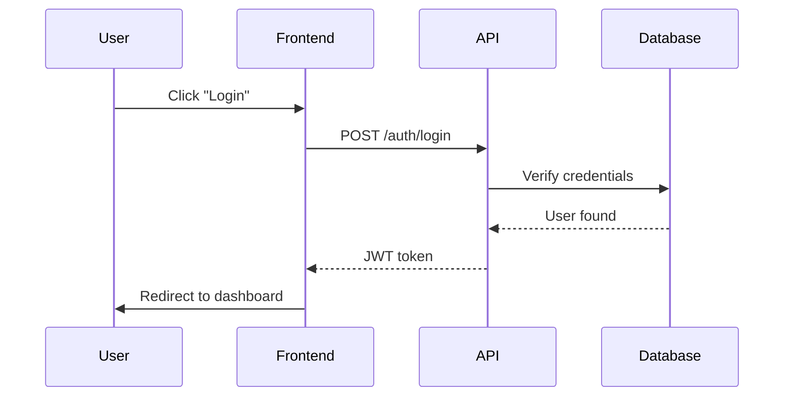

# Documentation Generation

Generate comprehensive technical documentation across multiple layers: API documentation, code documentation, documentation sites, architecture decisions, and system diagrams.

## When to Use This Skill

Use this skill when:

- Documenting REST or GraphQL APIs with OpenAPI specifications
- Creating code documentation for libraries (TypeScript, Python, Go, Rust)
- Building documentation sites for projects or products
- Recording architectural decisions (ADRs) for system design choices
- Generating diagrams to visualize system architecture or data flows
- Setting up automated documentation pipelines in CI/CD

## Documentation Layers Overview

Technical documentation operates at five distinct layers:

**Layer 1: API Documentation** - OpenAPI specs for REST/GraphQL APIs (Swagger UI, Redoc, Scalar)
**Layer 2: Code Documentation** - Generated from code comments (TypeDoc, Sphinx, godoc, rustdoc)
**Layer 3: Documentation Sites** - Comprehensive guides and tutorials (Docusaurus, MkDocs)
**Layer 4: Architecture Decisions** - ADRs using MADR template format
**Layer 5: Diagrams** - Visual architecture (Mermaid, PlantUML, D2)

See `references/api-documentation.md`, `references/code-documentation.md`, and `references/documentation-sites.md` for detailed guides.

## Quick Decision Framework

### Which Documentation Layer?

```
API for external consumers?
  → Layer 1: API Documentation (OpenAPI + Swagger UI/Redoc)

Code for maintainers?
  → Layer 2: Code Documentation (TypeDoc/Sphinx/godoc/rustdoc)

Comprehensive guides?
  → Layer 3: Documentation Site (Docusaurus/MkDocs)

Architectural decision?
  → Layer 4: ADR (MADR template)

Visual system design?
  → Layer 5: Diagrams (Mermaid/PlantUML/D2)
```

### Tool Selection Matrix

| Need | Primary Tool | Best For |
|------|-------------|----------|
| **Doc Site** | Docusaurus | Feature-rich React sites |
| **Doc Site** | MkDocs Material | Simple Python docs |
| **API Docs (Interactive)** | Swagger UI | Testing |
| **API Docs (Read-Only)** | Redoc | Professional design |
| **TypeScript** | TypeDoc | All TS projects |
| **Python** | Sphinx | All Python projects |
| **Go** | godoc | Built-in |
| **Rust** | rustdoc | Built-in |
| **Diagrams** | Mermaid | All-purpose |

## API Documentation Quick Start

Create OpenAPI specification:

```yaml
openapi: 3.1.0
info:
  title: User API
  version: 1.0.0

servers:
  - url: https://api.example.com/v1

paths:
  /users/{userId}:
    get:
      summary: Get a user
      parameters:
        - name: userId
          in: path
          required: true
          schema:
            type: string
      responses:
        '200':
          description: Success
          content:
            application/json:
              schema:
                $ref: '#/components/schemas/User'

components:
  schemas:
    User:
      type: object
      required: [id, email, name]
      properties:
        id:
          type: string
        email:
          type: string
          format: email
        name:
          type: string

  securitySchemes:
    bearerAuth:
      type: http
      scheme: bearer
      bearerFormat: JWT

security:
  - bearerAuth: []
```

Render with Swagger UI, Redoc, or Scalar. See `references/api-documentation.md` for complete examples and `templates/openapi-template.yaml` for starter template.

## Code Documentation Quick Start

### TypeScript

```typescript
/**
 * Calculate the sum of two numbers.
 *
 * @param a - The first number
 * @param b - The second number
 * @returns The sum of a and b
 *
 * @example
 * ```typescript
 * const result = add(2, 3);
 * console.log(result); // 5
 * ```
 */
export function add(a: number, b: number): number {
  return a + b;
}
```

Generate docs:

```bash
npm install -D typedoc
npx typedoc --entryPoints src/index.ts --out docs
```

### Python

```python
def calculate_total(items: list[dict], tax_rate: float = 0.0) -> float:
    """Calculate the total price including tax.

    Args:
        items: List of items with 'price' and 'quantity' keys.
        tax_rate: Tax rate as decimal (e.g., 0.1 for 10%).

    Returns:
        Total price including tax.

    Example:
        >>> items = [{'price': 10, 'quantity': 2}]
        >>> calculate_total(items, tax_rate=0.1)
        22.0
    """
    subtotal = sum(item['price'] * item['quantity'] for item in items)
    return subtotal * (1 + tax_rate)
```

Generate docs:

```bash
pip install sphinx sphinx-rtd-theme
sphinx-quickstart docs
cd docs && make html
```

See `references/code-documentation.md` for Go and Rust examples.

## Documentation Site Quick Start

### Docusaurus

```bash
npx create-docusaurus@latest my-website classic
cd my-website
npm start
```

Basic config:

```javascript
// docusaurus.config.js
module.exports = {
  title: 'My Project',
  url: 'https://docs.example.com',
  themeConfig: {
    navbar: {
      items: [
        {type: 'doc', docId: 'intro', label: 'Docs'},
      ],
    },
  },
  presets: [
    ['@docusaurus/preset-classic', {
      docs: {
        sidebarPath: require.resolve('./sidebars.js'),
      },
    }],
  ],
};
```

### MkDocs

```bash
pip install mkdocs mkdocs-material
mkdocs new my-project
mkdocs serve
```

Basic config:

```yaml
# mkdocs.yml
site_name: My Project
theme:
  name: material
  features:
    - navigation.tabs
    - search.suggest

plugins:
  - search

nav:
  - Home: index.md
  - Getting Started: getting-started.md
```

See `references/documentation-sites.md` for versioning and deployment.

## Architecture Decision Records

Use MADR template for recording decisions:

```markdown
# Use PostgreSQL for Primary Database

* Status: accepted
* Deciders: Engineering Team, CTO
* Date: 2025-01-15

## Context and Problem Statement

Application requires relational database with complex queries,
ACID transactions, JSON support, and full-text search.

## Decision Drivers

* Data integrity (ACID compliance)
* Performance (10K+ queries/second)
* Cost (open-source preferred)
* Features (JSONB, full-text search)

## Considered Options

* PostgreSQL
* MySQL
* Amazon Aurora

## Decision Outcome

Chosen "PostgreSQL" for best balance of features and cost.

### Positive Consequences

* Open-source with no licensing costs
* Advanced features (JSONB, full-text search)
* Strong ACID compliance

### Negative Consequences

* Self-hosting requires DevOps investment
* Horizontal scaling requires changes
```

Copy full template from `templates/adr-template.md`. See `references/adr-guide.md` for workflow and `examples/adr/0001-database-selection.md` for complete example.

## Diagrams Quick Start

Create diagrams with Mermaid:

````markdown

````

Mermaid renders in GitHub, Docusaurus, and MkDocs. See `references/diagram-generation.md` for PlantUML and D2 examples.

## Common Patterns

### Design-First vs Code-First APIs

**Design-First:**
1. Write OpenAPI spec
2. Review with stakeholders
3. Generate server stubs
4. Implement handlers

**Pros:** Contract before implementation, parallel development
**Cons:** Spec authoring can be verbose

**Code-First:**
1. Implement API with decorators
2. Generate OpenAPI from code
3. Publish documentation

**Pros:** Faster development, spec matches code
**Cons:** Documentation lags behind

**Recommendation:** Design-first for new APIs, code-first for existing.

### Embedding API Docs in Sites

Docusaurus integration:

```javascript
// docusaurus.config.js
plugins: [
  ['docusaurus-plugin-openapi-docs', {
    config: {
      api: {
        specPath: 'openapi/api.yaml',
        outputDir: 'docs/api',
      },
    },
  }],
],
themes: ['docusaurus-theme-openapi-docs'],
```

See `references/api-documentation.md` for MkDocs integration.

### CI/CD Automation

```yaml
# .github/workflows/docs.yml
name: Documentation

on:
  push:
    branches: [main]

jobs:
  build-deploy:
    runs-on: ubuntu-latest
    steps:
      - uses: actions/checkout@v4
      - uses: actions/setup-node@v4

      - name: Generate API docs
        run: npm run docs:api

      - name: Generate code docs
        run: npm run docs:code

      - name: Build site
        run: npm run docs:build

      - name: Deploy to GitHub Pages
        uses: peaceiris/actions-gh-pages@v3
        with:
          github_token: ${{ secrets.GITHUB_TOKEN }}
          publish_dir: ./build
```

See `references/ci-cd-integration.md` for validation and versioning.

### When to Write an ADR

**Write ADRs for:**

✅ Technology selection (database, framework, cloud)
✅ Architecture patterns (microservices, event-driven)
✅ Decisions with trade-offs (pros/cons)
✅ Team alignment needed

**Don't write ADRs for:**

❌ Trivial decisions (naming, formatting)
❌ Easily reversible (config tweaks)
❌ Implementation details (document in code)

See `references/adr-guide.md` for workflow and examples.

## Reference Documentation

For detailed guides:

- **`references/api-documentation.md`** - OpenAPI, Swagger UI, Redoc, Scalar, design-first vs code-first
- **`references/code-documentation.md`** - TypeDoc, Sphinx, godoc, rustdoc with examples
- **`references/documentation-sites.md`** - Docusaurus and MkDocs setup, versioning, deployment
- **`references/adr-guide.md`** - MADR template, workflow, when to write ADRs
- **`references/diagram-generation.md`** - Mermaid, PlantUML, D2 syntax and integration
- **`references/ci-cd-integration.md`** - Automation, validation, deployment strategies

## Templates

- **`templates/adr-template.md`** - MADR template for Architecture Decision Records
- **`templates/openapi-template.yaml`** - OpenAPI 3.1 specification starter

## Examples

- **`examples/openapi/`** - Complete OpenAPI specifications
- **`examples/typescript/`** - TypeDoc configuration and TSDoc examples
- **`examples/python/`** - Sphinx configuration and docstring examples
- **`examples/adr/`** - Real-world Architecture Decision Records
- **`examples/diagrams/`** - Mermaid, PlantUML, D2 examples

## Tool Recommendations

Based on research (December 2025):

**Documentation Sites:**
- **Docusaurus** - React-based, feature-rich (versioning, i18n, search)
- **MkDocs Material** - Python-based, simple, beautiful

**API Documentation:**
- **Swagger UI** - Interactive testing
- **Redoc** - Beautiful read-only
- **Scalar** - Modern 2025 design

**Code Documentation:**
- **TypeScript:** TypeDoc
- **Python:** Sphinx
- **Go:** godoc (built-in)
- **Rust:** rustdoc (built-in)

**Diagrams:**
- **Mermaid** - Most popular, GitHub-integrated
- **PlantUML** - UML standard
- **D2** - Modern, declarative

## Integration with Other Skills

- **`api-patterns`** - API implementation and documentation
- **`building-ci-pipelines`** - Automate documentation generation
- **`testing-strategies`** - Document test patterns
- **`sdk-design`** - Generate SDK documentation

## Best Practices

1. **Docs-as-Code** - Keep docs in version control
2. **Single Source of Truth** - Generate from code/specs
3. **Automation** - Generate in CI/CD pipelines
4. **Examples** - Include working code examples
5. **Validation** - Lint Markdown, validate specs
6. **Versioning** - Version docs with releases
7. **Consistency** - Use consistent terminology
8. **Maintenance** - Update when code changes

## Common Pitfalls

**Documentation Drift** - Docs become outdated
→ Automate generation, validate in CI/CD

**Over-Documentation** - Documenting obvious behavior
→ Focus on "why" not "what"

**Fragmented Docs** - Information scattered
→ Single site with clear navigation

**No Examples** - Theory without practice
→ Include runnable examples
