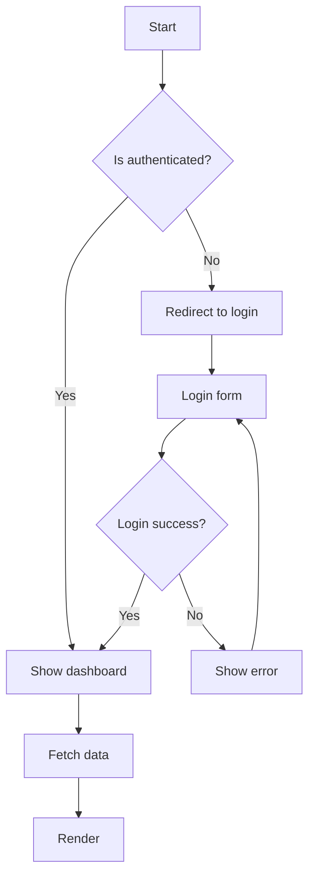
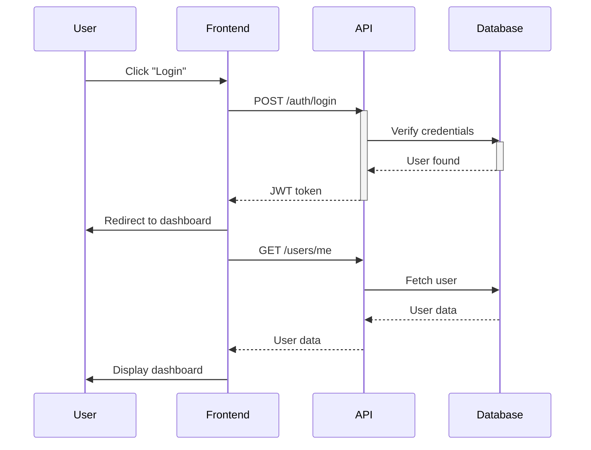
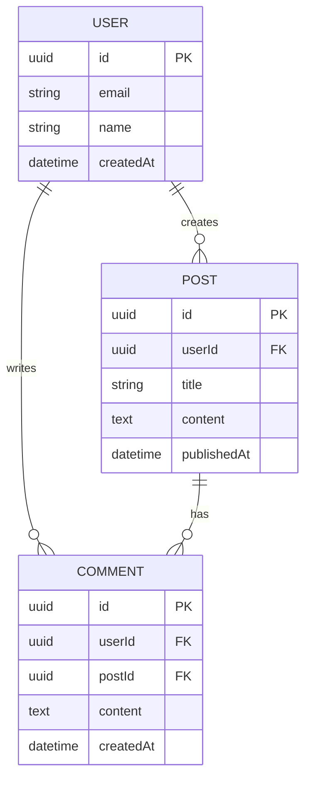
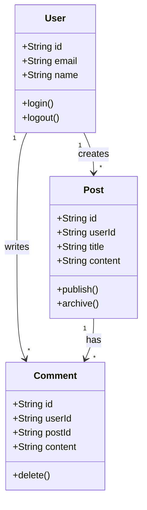
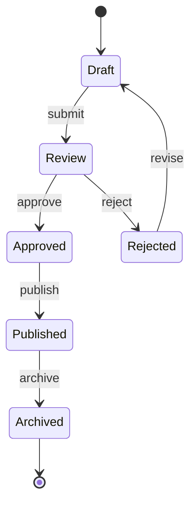
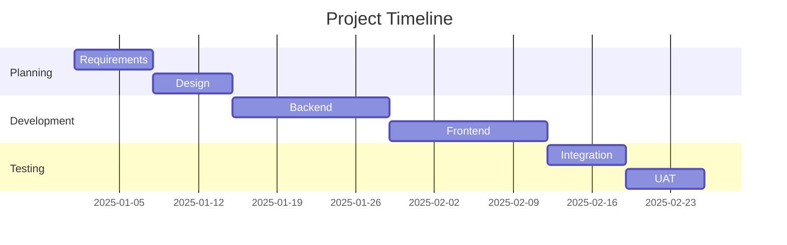
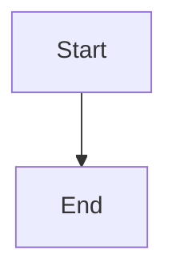
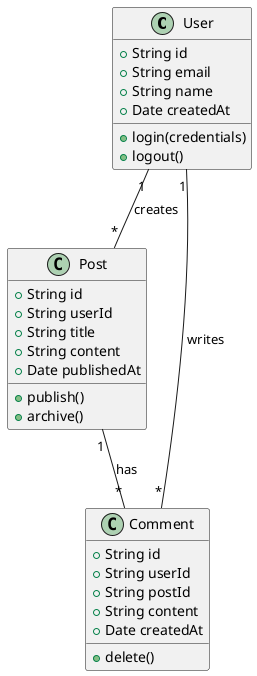
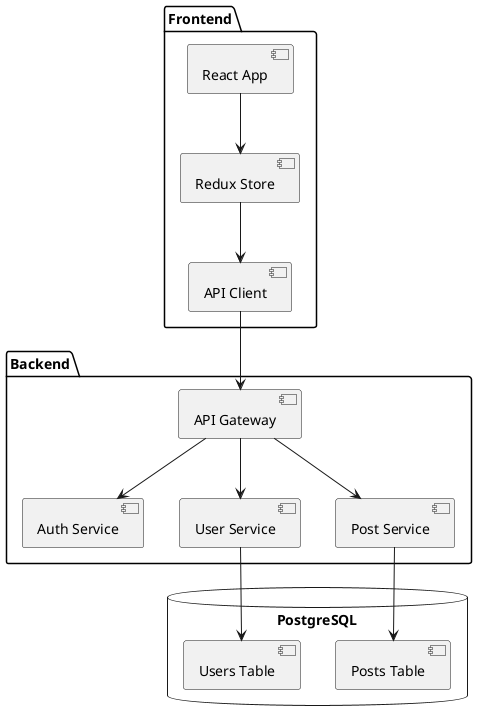
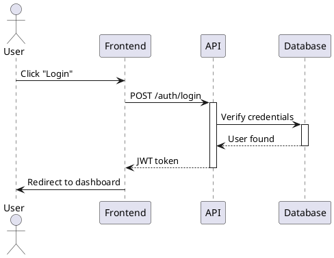

# Diagram Generation Reference

Guide to creating diagrams with Mermaid, PlantUML, and D2.

## Table of Contents

1. [Mermaid](#mermaid)
2. [PlantUML](#plantuml)
3. [D2](#d2)
4. [Tool Comparison](#tool-comparison)

## Mermaid

Text-based diagramming tool integrated with GitHub, GitLab, Docusaurus, and MkDocs.

### Supported Diagram Types

- Flowcharts
- Sequence diagrams
- Class diagrams
- State diagrams
- Entity-relationship diagrams
- Gantt charts
- Pie charts
- Git graphs
- User journey diagrams

### Flowchart Example



### Sequence Diagram Example



### Entity-Relationship Diagram



### Class Diagram



### State Diagram



### Gantt Chart



### Integration

#### Markdown (GitHub/GitLab)

````markdown

````

#### Docusaurus

```javascript
// docusaurus.config.js
module.exports = {
  markdown: {
    mermaid: true,
  },
  themes: ['@docusaurus/theme-mermaid'],
};
```

#### MkDocs

```yaml
# mkdocs.yml
markdown_extensions:
  - pymdownx.superfences:
      custom_fences:
        - name: mermaid
          class: mermaid
          format: !!python/name:pymdownx.superfences.fence_code_format
```

## PlantUML

UML diagram tool with comprehensive diagram type support.

### Class Diagram



### Component Diagram



### Sequence Diagram



### Installation and Rendering

```bash
# Install PlantUML
brew install plantuml

# Generate PNG
plantuml diagram.puml

# Generate SVG
plantuml -tsvg diagram.puml

# Watch for changes
plantuml -tsvg -gui diagram.puml
```

## D2

Modern declarative diagramming language.

### System Architecture

```d2
# System Architecture

frontend: Frontend {
  shape: rectangle
  react: React App
  redux: Redux Store
  api: API Client
}

backend: Backend {
  shape: rectangle
  gateway: API Gateway
  auth: Auth Service
  user: User Service
  post: Post Service
}

db: PostgreSQL {
  shape: cylinder
  users: Users Table
  posts: Posts Table
}

frontend.react -> frontend.redux: updates state
frontend.redux -> frontend.api: makes requests
frontend.api -> backend.gateway: HTTP/HTTPS

backend.gateway -> backend.auth: authenticate
backend.gateway -> backend.user: user ops
backend.gateway -> backend.post: post ops

backend.user -> db.users: queries
backend.post -> db.posts: queries
```

### Network Diagram

```d2
direction: right

client: Client {
  shape: rectangle
  icon: https://icons.terrastruct.com/tech/022-computer.svg
}

lb: Load Balancer {
  shape: hexagon
}

web1: Web Server 1 {
  shape: rectangle
  icon: https://icons.terrastruct.com/tech/022-server.svg
}

web2: Web Server 2 {
  shape: rectangle
  icon: https://icons.terrastruct.com/tech/022-server.svg
}

db: Database {
  shape: cylinder
  icon: https://icons.terrastruct.com/tech/058-database.svg
}

client -> lb: HTTPS
lb -> web1: HTTP
lb -> web2: HTTP
web1 -> db: SQL
web2 -> db: SQL
```

### Installation and Rendering

```bash
# Install D2
brew install d2

# Generate SVG
d2 diagram.d2 diagram.svg

# Generate PNG
d2 diagram.d2 diagram.png

# Watch mode
d2 --watch diagram.d2 diagram.svg
```

## Tool Comparison

| Feature | Mermaid | PlantUML | D2 |
|---------|---------|----------|-----|
| **Ease of Use** | ⭐⭐⭐⭐⭐ | ⭐⭐⭐ | ⭐⭐⭐⭐ |
| **GitHub Integration** | ✅ Native | ❌ No | ❌ No |
| **Diagram Types** | ⭐⭐⭐⭐⭐ | ⭐⭐⭐⭐⭐ | ⭐⭐⭐⭐ |
| **Output Quality** | ⭐⭐⭐⭐ | ⭐⭐⭐⭐ | ⭐⭐⭐⭐⭐ |
| **Learning Curve** | Low | Medium | Low-Medium |
| **Best For** | All-purpose | UML diagrams | Architecture |

### Recommendations

**Use Mermaid for:**
- GitHub/GitLab documentation
- Documentation sites (Docusaurus, MkDocs)
- Quick diagrams
- Team collaboration (no tools required)

**Use PlantUML for:**
- Formal UML diagrams
- Complex class diagrams
- Enterprise architecture
- When UML compliance is required

**Use D2 for:**
- System architecture diagrams
- Beautiful output required
- Modern tech stacks
- Network diagrams

## Best Practices

1. **Keep It Simple**: Don't overcomplicate diagrams
2. **Use Meaningful Labels**: Clear, descriptive text
3. **Consistent Style**: Use same tool/style across project
4. **Version Control**: Store diagram source in git
5. **Update Regularly**: Keep diagrams in sync with code
6. **Embed in Docs**: Include diagrams in documentation
7. **Export SVG**: Vector graphics scale better than PNG
8. **Add Context**: Explain what diagram shows
9. **Test Rendering**: Verify diagrams render correctly
10. **Link to Code**: Reference implementation in diagrams
